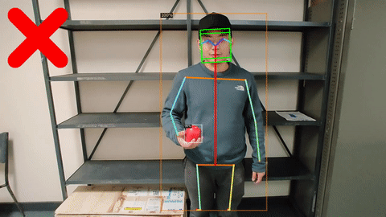
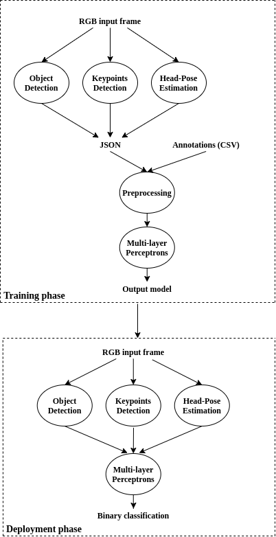

# Gesture Recognition for Initiating Human-to-Robot Handovers
* This is part of my summer research project at Monash University.
* The entire project is executed on my Nvidia GeForce GTX1060 graphic card.
* A custom dataset is created in Monash University to train the multi-layer perceptron.
* A total of 25 videos are recorded in a lab setting, containing a total of 2506 images.
* [Link](https://arxiv.org/abs/2007.09945) to arXiv.

<div align="center">
<br>
</div>


## Requirements
* [detectron2](https://github.com/facebookresearch/detectron2) (Follow [INSTALL.md](https://github.com/facebookresearch/detectron2/blob/master/INSTALL.md) to install detectron2)
* pytorch
* tensorflow
* [mtcnn](https://github.com/ipazc/mtcnn)
* yacs

## Pretrained models
Download the pretrained models for [object detection](https://drive.google.com/file/d/1gx6beqSOwh0mTkATEDe3tdKdya-vPZSZ/view?usp=sharing), [head pose estimation](https://drive.google.com/file/d/1kY2nfpnFsows14TLKTOd-8PYftOAeomh/view?usp=sharing) and [MLP](https://drive.google.com/file/d/157lPmRjEUj6P1ovzsUklnXMe9PCT5mp1/view?usp=sharing). Place them in ```./pretrained-weights```.

## System Diagram
The system diagram is shown below for illustration purposes.

<br>


## Training process
### Step 1: Run system for generating relevant training data
```bash
python3 main.py \
        --cfg-keypoint ./configs/keypoint_rcnn_R_101_FPN_3x.yaml \
        --cfg-object ./configs/object_faster_rcnn_R_101_FPN_3x.yaml \
        --obj-weights ./pretrained-weights/Apple_Faster_RCNN_R_101_FPN_3x.pth \
        --video-input [VIDEO_INPUT] \
        --output [OUTPUT] \
        --out-json [JSON FILE] \
        --train
```

### Step 2: Preprocess JSON file for MLP training
```bash
python3 utils/json_utils.py --json-path [JSON_FOLDER] --csv-path [classes.csv] \
                            --output-json post_processing.json
```

### Step 3: Train MLP network
```bash
python3 training/train_MLP_localize.py --json-path [JSON_FILE] --weights-path [PATH_TO_WEIGHTS]
```

## Deployment
```bash
python3 main.py \
        --cfg-keypoint ./configs/keypoint_rcnn_R_101_FPN_3x.yaml \
        --cfg-object ./configs/object_faster_rcnn_R_101_FPN_3x.yaml \
        --obj-weights ./pretrained-weights/Apple_Faster_RCNN_R_101_FPN_3x.pth \
        --video-input [VIDEO_INPUT] \
        --output [OUTPUT]
```

## Credits
* [natanielruiz/deep-head-pose](https://github.com/natanielruiz/deep-head-pose)
* [facebookresearch/detectron2](https://github.com/facebookresearch/detectron2)
